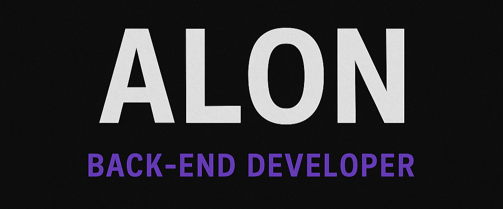

```js
console.log(`Hi, I'm Alon...`)
```
<p align="center">
  
</p>

---

## 📁 Projects
- 👾 [Base-for-Discordjs](https://github.com/alonsx-dev/Base-for-Discordjs)
---
## 🧠 My Stack

<p align="center">
  <a href="https://skillicons.dev">
    
  </a>
</p>
